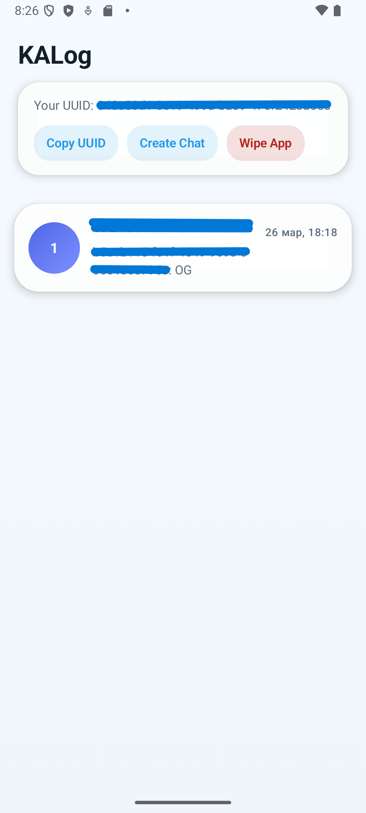
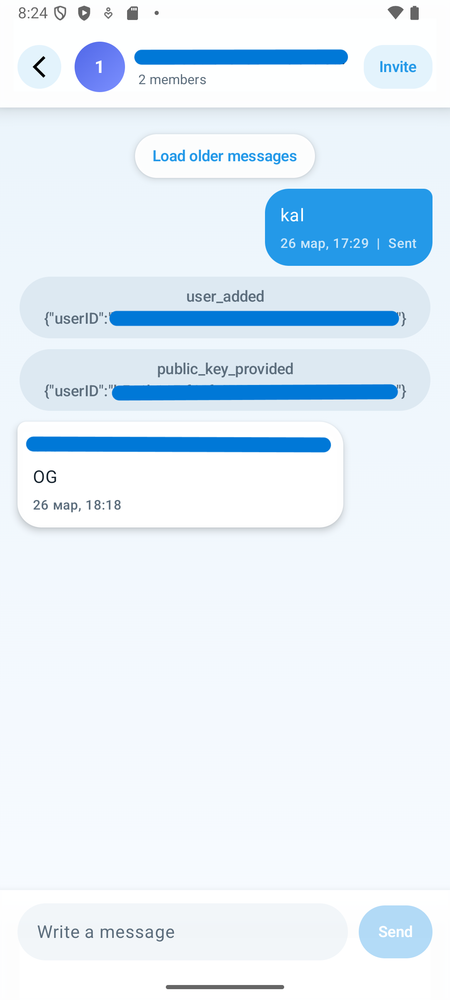
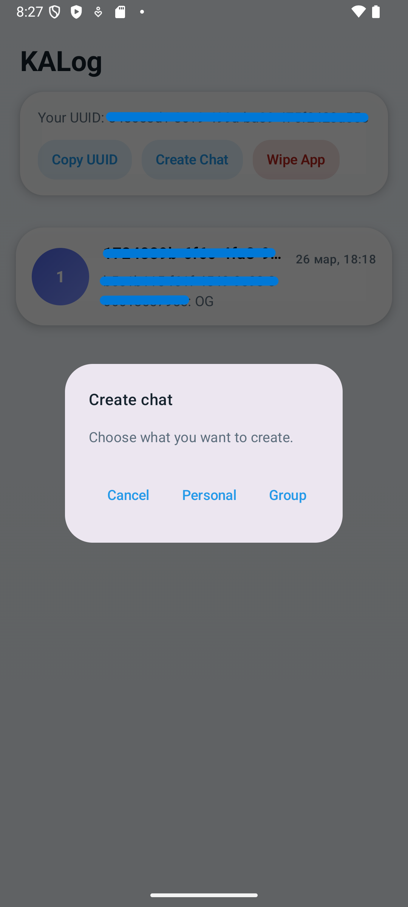
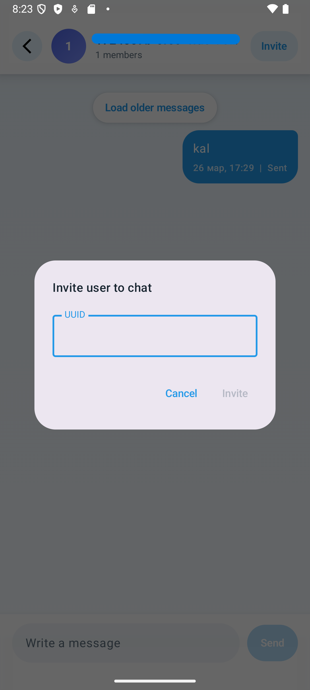
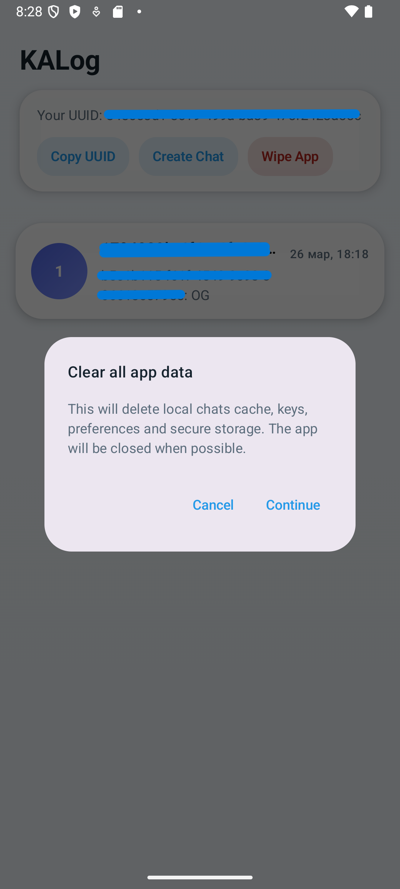

# KALog

[Read in Russian](README.ru.md)

KALog is a Kotlin Multiplatform secure chat client for Android, iOS, and Desktop JVM. The project uses Compose Multiplatform for UI, Koin for dependency injection, Ktor for networking, and dedicated modules for cryptography, preferences, and secure key storage.

This README intentionally does not include backend addresses, real UUIDs, keys, internal hosts, or low-level cryptographic protocol details.

## What the application does

KALog provides a compact secure messaging flow:

- initializes a user session and shows the current user UUID;
- lets the user copy that UUID and share it out of band;
- creates personal chats by another user's UUID;
- creates group chats and invites users by UUID;
- opens chats, shows current conversation state, and loads older history;
- keeps a background sync loop for incoming messages and unread counters;
- supports full cleanup of local app data.

## How the application works

### User flow

1. On startup, the app initializes a local session and receives the user UUID from the backend service.
2. The main screen shows the current UUID and the list of available chats.
3. The user can:
   - create a personal chat by entering another user's UUID;
   - create a group chat and then invite participants from the chat screen.
4. When a chat is opened, the app shows available messages and can load older history on demand.
5. Sending and receiving messages are synchronized in the background, while the UI updates previews and unread counters.
6. The `Wipe App` action removes local cache, keys, and settings.

### Technical flow

- `ChatSessionViewModel` starts the continuous sync loop.
- `ChatListViewModel` initializes the session, loads the current UUID, observes chats, creates chats, and clears local data.
- `ChatDetailsViewModel` opens the selected chat, sends messages, loads older history, and invites users into group chats.
- `OfflineFirstChatRepository` coordinates local cache, remote calls, participant keys, encryption/decryption, and incremental synchronization.
- Incoming messages are decrypted locally before being rendered on screen.

## How to use

### Basic workflow

1. Launch the app and wait until your UUID appears on the main screen.
2. Press `Copy UUID` and share that UUID with another user through a safe external channel.
3. Press `Create Chat`:
   - choose `Personal` to create a one-to-one chat by UUID;
   - choose `Group` to create a group chat.
4. Open the required chat from the list and type a message in the composer.
5. In a group chat, use `Invite` to add another participant by UUID.
6. If older history is available, press `Load older messages`.
7. If you need to remove local traces of app activity, use `Wipe App`.

### Important runtime behavior

- The sync loop starts automatically.
- Unread counters increase only for chats that are not currently open.
- The `Invite` action is available only in group chats.
- On Android and Desktop, clearing data attempts to close the app after cleanup. On iOS, the app resets UI state instead of force-closing the process.

## Data protection

### Cryptography principle

KALog uses asymmetric cryptography as the basis for protecting transport payloads and message contents. Key material is generated on the client device, the public part is shared only where it is required for communication, and the private part stays on the device. Message contents are decrypted locally on the recipient side.

For safety reasons, this README does not describe exact protocol steps, key formats, algorithm parameters, or other low-level implementation details.

### How user data is protected

- Message text is protected on the client before it is sent over the network.
- For multi-recipient delivery, outgoing payloads are prepared separately for each recipient.
- Protected server responses are decrypted locally before being transformed into UI models.
- Private keys are stored separately from regular user settings.
- The app can remove regular settings, secure storage, and local chat cache in a single cleanup action.

### Local storage model

- Android: private keys are stored in encrypted local storage backed by Android Keystore.
- iOS: private keys are stored through Keychain-backed storage.
- Desktop JVM: secure settings currently rely on user preferences. That is acceptable for development, but weaker than OS-level secret vaults and should be hardened before production use.
- In the current chat implementation, the chat list and loaded messages live in runtime memory. A dedicated `core/database` module already exists, but the current chat flow has not yet been migrated to persistent local storage.

### Important security boundaries

- KALog protects message content and protected request payloads, but the backend still processes service metadata required for chat routing.
- The initial session bootstrap exchanges public information needed for the protected channel; the main API flow uses protected requests after that point.
- Application-level cryptographic protection should complement transport hardening and release hardening, not replace them.

## Architecture

The project is split into shared and platform-specific modules.

### Module overview

- `androidApp/` - Android launcher application.
- `composeApp/` - shared Compose UI, app bootstrap, and platform DI bindings.
- `feature/chat/` - chat module: presentation, use cases, repository, remote/local sources, and chat-specific crypto logic.
- `core/crypto/` - cryptographic abstractions, key generation, and encryption services.
- `core/network/` - Ktor client, secure request wrapping, transport security provider, and network configuration.
- `core/preferences/` - regular and secure key-value storage with platform-specific implementations.
- `core/database/` - SQLDelight layer prepared for local persistence.
- `KALog/` - iOS host app and Xcode project.

### Layers

- Presentation layer: Compose screens, routes, dialogs, and ViewModels.
- Domain layer: use cases and chat domain models.
- Data layer: repository, API adapter, local cache, settings, and key storage.
- Platform layer: HTTP clients, database drivers, secure settings factories, and platform-specific behavior.

## Build and run

### Requirements

- JDK 11+
- Android Studio or IntelliJ IDEA for Android/Desktop development
- Xcode on macOS for iOS build and run
- A compatible backend environment available outside this repository

### Android

- In IDE: run the `androidApp` configuration.
- Windows:

```powershell
.\gradlew.bat :androidApp:assembleDebug
```

- macOS/Linux:

```bash
./gradlew :androidApp:assembleDebug
```

### Desktop JVM

- Windows:

```powershell
.\gradlew.bat :composeApp:run
```

- macOS/Linux:

```bash
./gradlew :composeApp:run
```

### iOS

Open [KALog.xcodeproj](./KALog/KALog.xcodeproj) in Xcode and run the `KALog` target on macOS.

## Screenshots and diagrams
### Main screen screenshot



### Chat screen screenshot



### Create/invite screenshots

 

### Wipe app screenshot



### Architecture diagram

Coming soon.

## Current limitations and production recommendations

- The current chat cache is in memory; persistent storage is prepared in `core/database`, but is not used yet.
- Desktop secure storage should be replaced with a stronger OS-level secret storage integration.
- Production deployment should enforce HTTPS/TLS, harden release configuration, and minimize network debug logging.
