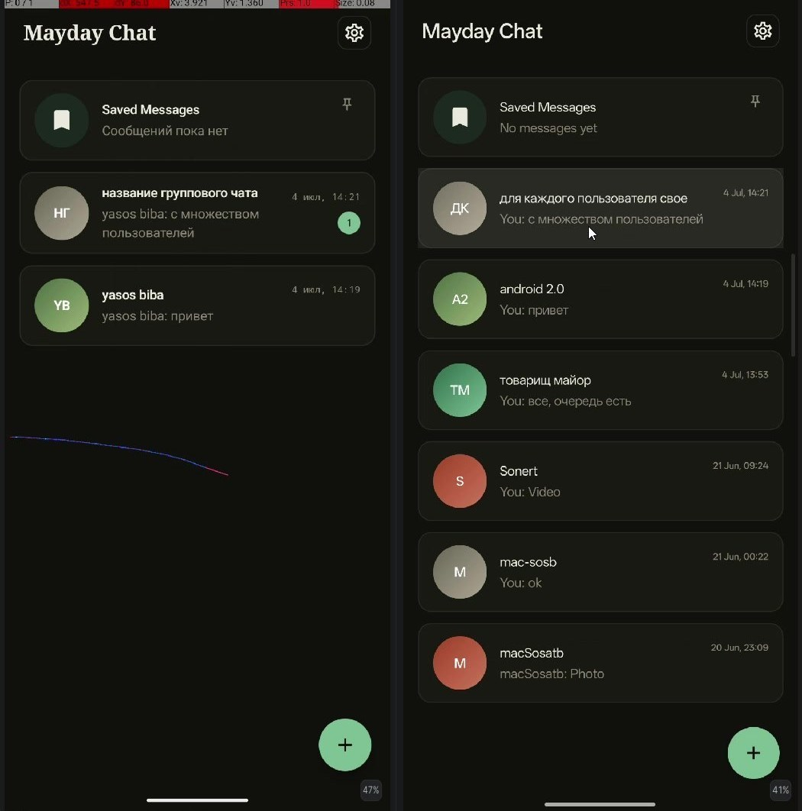
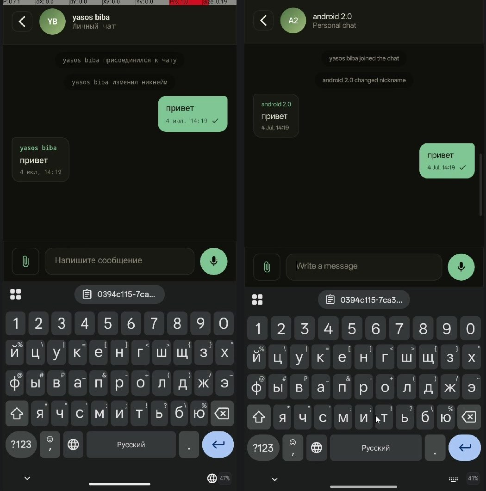
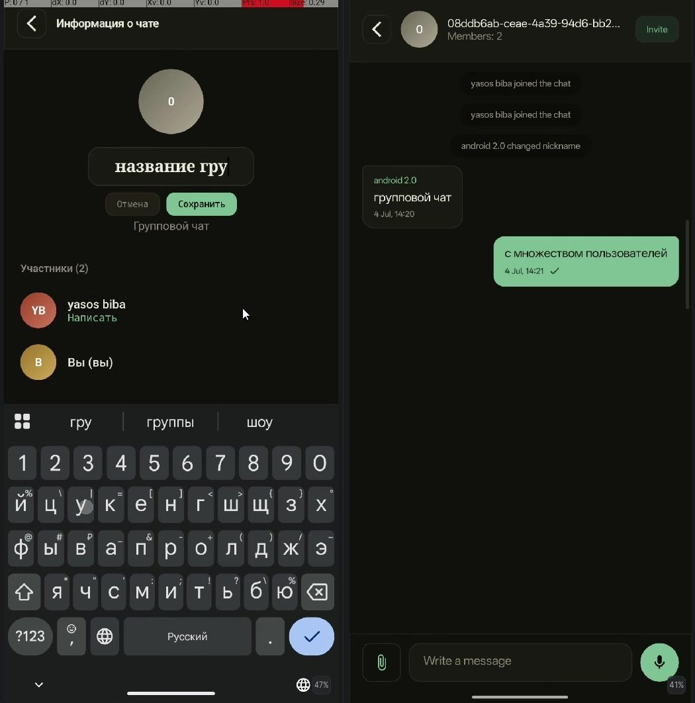
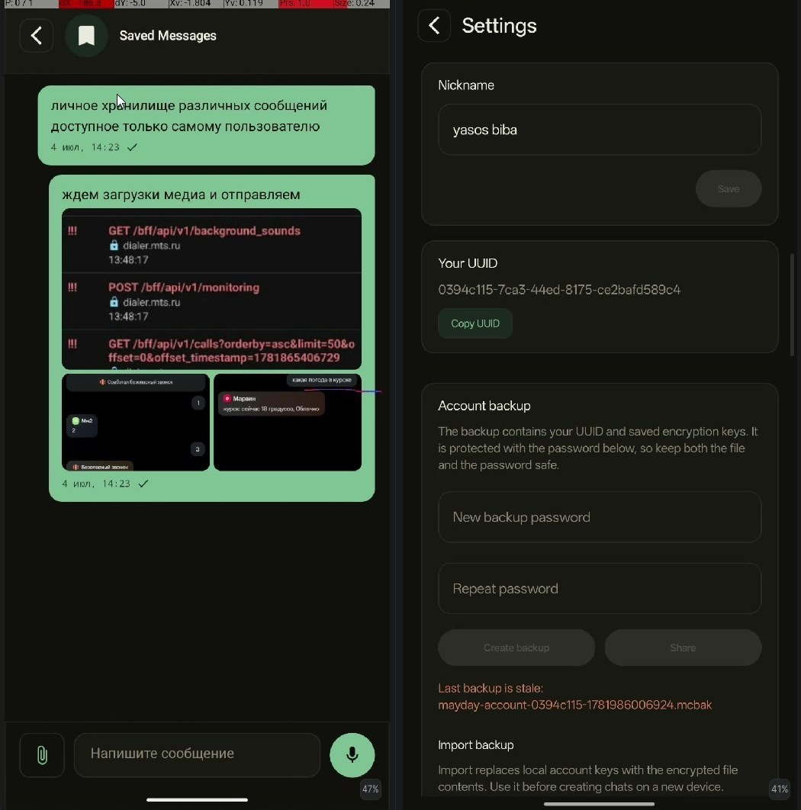
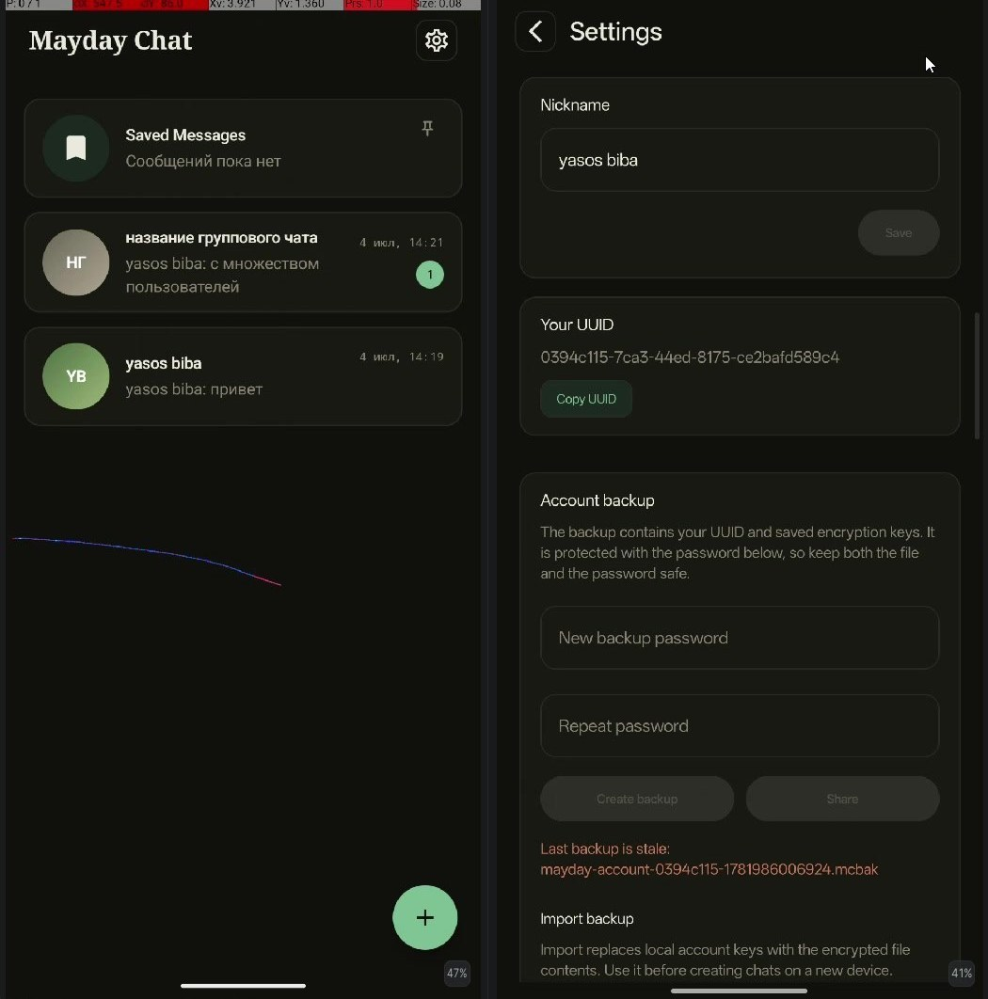
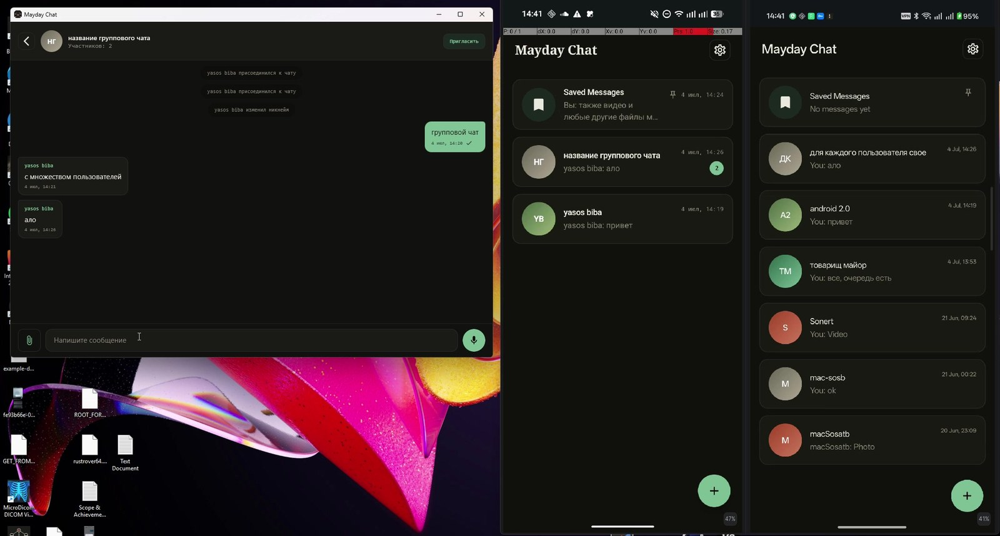

# Mayday Chat

[Read in Russian](README.ru.md)

Mayday Chat is a Kotlin Multiplatform secure messaging client for Android, iOS, and Desktop JVM (Windows and macOS). It is built as a project with a privacy-first product model: users connect by sharing an app-generated UUID instead of using phone numbers, email addresses, or public social identifiers.

## Screenshots

<table>
  <tr>
    <td>
       
      Chat list, Saved Messages, group chat preview, and quick access to settings.
    </td>
    <td>
       
      Personal chat created by another user's UUID.
    </td>
  </tr>
  <tr>
    <td>
       
      Group chat with participants, invitation flow, and editable title.
    </td>
    <td>
       
      Image and file attachments inside a regular chat flow.
    </td>
  </tr>
  <tr>
    <td>
       
      Settings screen with UUID, nickname, theme, backup, and import controls.
    </td>
    <td>
       
      Account backup/import demo from Android to Windows Desktop.
    </td>
  </tr>
</table>

## Demo Videos

- [Onboarding, app lock, personal chats, group chats, and attachments](https://github.com/nAglTI/mayday-chat/releases/download/v1.0.0-alpha/full-onboarding-and-chats-demo.mp4)
- [Password-protected account backup and Android to Windows import](https://github.com/nAglTI/mayday-chat/releases/download/v1.0.0-alpha/account-backup-android-to-windows-demo.mp4)

## What It Can Do

- Create a new account without phone or email sign-up.
- Show the user's UUID so it can be shared manually with another person.
- Create personal chats by another user's UUID.
- Create group chats and invite participants by UUID.
- Send text messages, images, videos, and other file attachments.
- Use Saved Messages as a private space for notes and files.
- Protect the app startup with system device authentication where available.
- Export and import an account backup to move the same demo account between devices.
- Switch theme, edit nickname, and clear local app data.

## Privacy Model

Mayday Chat uses UUIDs as public contact identifiers because phone numbers and email addresses can directly connect an account to a real person. A UUID is still an identifier, but it is not personal contact data by itself.

This keeps the contact flow explicit:

- users decide when and where to share their UUID;
- the app does not require phone book access for account creation;
- there is no email or phone number login flow in the product model;
- someone cannot find a user by guessing their personal contact details inside the app.

This does not mean the app promises complete anonymity. The backend still needs service data to route chats and deliver messages. The goal is narrower and practical: avoid collecting personal login identifiers when they are not needed for the messenger experience.

## Data Protection

The project is designed around client-side protection of chat content and account data:

- message content is prepared on the client before it is sent to the server;
- received content is processed locally before it is shown in the UI;
- account backups are protected by a user-provided password;
- local data can be wiped from the app settings.

The startup lock is an important part of the security model. Chat keys and account secrets have to exist on the user's device, otherwise the app could not decrypt messages or move an account between devices. Because of that, Mayday Chat does not treat local storage as the only line of defense. The app also uses platform security gates before showing account data or letting sensitive account flows run.

Platform behavior is intentionally different:

- Android uses the system device unlock flow: biometrics or device credentials depending on OS version and device setup.
- Windows Desktop uses a native credentials prompt with Windows Hello support where the system provides it, with a fallback to the current user's Windows credentials.
- macOS Desktop uses Keychain-backed user presence checks, which can be satisfied by Touch ID, Apple Watch unlock, or the device password depending on the user's system configuration.
- iOS stores sensitive account values through Keychain-backed storage, keeping platform-specific protection behind the same secure storage bridge used by the shared app code.

The product principle is the same across targets: account UI and locally stored encryption material should be protected by the strongest owner-verification mechanism that the platform can provide.

Low-level protocol details, key formats, internal hosts, and private test environment values are intentionally not documented in this public README.

## Product Flow

1. The user opens the app and passes the device unlock check if it is enabled.
2. A new account can be created without entering personal contact data.
3. The user copies their UUID and shares it with another person through any external channel.
4. A personal or group chat can be created by entering another user's UUID.
5. Messages and attachments appear in the chat list and conversation screens.
6. A password-protected backup can be created and imported on another device.

## Architecture And Engineering Notes

Mayday Chat is split into shared and platform-specific modules.

- `composeApp` contains the shared Compose Multiplatform UI, navigation, app bootstrap, and dependency wiring.
- `androidApp` hosts the Android entry point.
- `KALog` contains the iOS host project.
- `feature/chat` contains chat screens, presentation state, use cases, repository coordination, chat creation, invitations, attachments, and backup/import flows.
- `core/network` contains the network client and API integration layer.
- `core/preferences` contains regular and protected key-value storage abstractions.
- `core/crypto` contains shared data protection abstractions used by chat and account flows.
- `core/database` is prepared for local persistence work.

The project follows a layered structure:

- UI and ViewModels expose screen state and user actions.
- Use cases keep feature entry points explicit.
- Repositories coordinate network calls, local state, account data, chat state, and background synchronization.
- Platform bridges isolate Android, iOS, and Desktop behavior such as file picking, sharing, app lock, and local secure storage.

### Platform Bridges

The shared Kotlin code owns the product flow, while platform bridges provide the operating-system pieces that cannot be implemented once in common code:

- startup owner verification;
- protected key-value storage;
- account backup file picking and sharing;
- attachment picking, preview, opening, and sharing;
- desktop-specific packaging and application lifecycle behavior.

This keeps the chat feature mostly shared while still allowing each platform to use its native security model instead of a lowest-common-denominator abstraction.

### Key Storage Strategy

The app uses a shared interface for account and chat secrets, but the implementation is platform-aware:

- Android relies on Android's secure storage facilities and the configured device lock.
- iOS uses Keychain-backed storage for sensitive values.
- Windows Desktop uses Windows-protected local storage and native credential gates.
- macOS Desktop uses Keychain-backed storage and Keychain user-presence checks.

Account backup/import is part of the product, so the project has to balance two goals: keys must be protected locally, but an explicit user action must still be able to export a password-protected account backup. This is why the README describes the security model at a product and architecture level rather than exposing low-level key formats.

## Tech Stack

- Kotlin Multiplatform
- Compose Multiplatform
- Kotlin Coroutines and Flow
- Koin
- Ktor
- SQLDelight module prepared for persistence
- Android, iOS, and Desktop JVM targets
- Platform specific security libraries and technologies

The engineering work is in the combination of Kotlin Multiplatform, Compose Multiplatform UI, modular feature boundaries, platform-specific integrations, account portability, and privacy-oriented product decisions.

## Current Status

This repository is a public project in alpha state. It demonstrates the app flow, cross-platform UI, chat logic, account backup/import, platform security bridges, and privacy-oriented contact model.

Because the project is still alpha, server availability issues, application bugs, incomplete translations, and unfinished edge-case handling are expected.

## License

Mayday Chat is licensed under the [Apache License 2.0](LICENSE).
